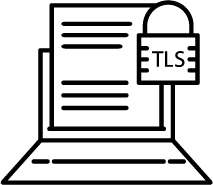

# Certificate Manager (WIP)



TLS Certificate Generator and Management System

Create CA signed TLS certificates for customers, set certs as active/inactive, and get a full list of all certificates (active, inactive, or both).

For a full list of functionality see the `Requests` section below.

*Note:* This is still a WIP, see a list of TODOs at the end of this file.

## Getting Started

Set up a root level `.env` file like the `sample.env` file for your database credentials; creating your own password, username, and database name. 
Keep the port and host from `sample.env` to work with the current docker-compose setup from the Makefile.

To run the application:
```bash
make run_app
```
localhost:10000 (app) and localhost:5432 (db) will be exposed at this point.

Check that the app is running properly:

```bash
curl -I localhost:10000/healthz
```

Log into the database from the command line: 
```bash
psql -h localhost -p 5432 -U <user> --dbname=<dbName>

\c <dbName>              # connect to db

\dt                      # see tables
```

Run postgres package tests:
```bash
make test_postgres
```

## Requests

### Create a customer

`email` is a unique constraint, so an error will be returned if a duplicate customer email is detected in the request

Passwords are hashed and salted using [bcrypt](https://godoc.org/golang.org/x/crypto/bcrypt)

`POST /customer`

```bash
curl -X POST --write-out %{http_code} -d '{ "firstName": "sharky", "lastName": "sharks", "email": "sharky@sharks.com", "password": "pass"}' -H 'Content-Type: application/json' localhost:10000/customer
```

### Create a certificate
`POST /customer/{customer_id}/certificate`
```bash
curl -X POST --write-out %{http_code} -d '{ "options": {"subject": { "organization": "my org", "country": "us", "locality": "austin" }, "expYearsLength": 2, "hosts": ["127.0.0.1"]} }' -H 'Content-Type: application/json' localhost:10000/customer/3/certificate | jq .
```

### Update a certificate
Only changes to the `Active` field are considered, all other changes are ignored.

`PUT /certificate/{cert_id}?active=true`

`PUT /certificate/{cert_id}?active=false`

`PUT /certificate/{cert_id}?active=true&notify=true` - optional parameter `notify=true` will send notification of active status change for certificate

currently `notify=true` send a dummy request to an [httpbin.org](http.org) endpoint 

```bash
curl -X PUT --write-out %{http_code} "localhost:10000/certificate/3?notify=false&active=false"
```

### List all certificates for a customer
Options:

`GET /customer/{customer_id}/certificates?active=true` - return all active certificates

`GET /customer/{customer_id}/certificates?active=false` - return all inactive certificates

`GET /customer/{customer_id}/certificates` - return all certificates

```bash
curl -X GET --write-out %{http_code} localhost:10000/customer/1/certificates?active=true | jq .
```

### Delete a customer
Deleting a customer also deletes all associated certificates

`DELETE /customer/{customer_id}`

```bash
curl -X DELETE --write-out %{http_code} localhost:10000/customer/1
```

## TODOs

- add authNZ to api/endpoints - pw is hashed and salted before storing in the db, but it is not being used to gate access to any endpoints at this time
- secure private certificate keys - currently stored in plain text
- Move CA cert and key into DB
- implement rate limiting, pagination, record count on response
- replace database id in public api responses with uuid
- clean up public responses - should have clear responses
- add more input/request validation
- add api tests
- add more logging all around
- implement configurable external service notifier, replacing httpbin.org request
- generate more detailed API documentation